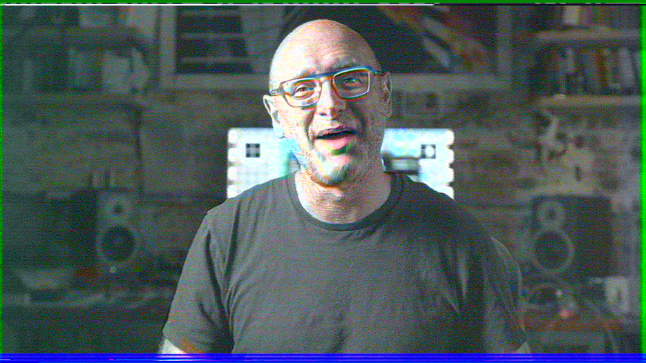

# W-VHS Decode

Tools for capturing and decoding W-VHS (analog HD) video signals from oscilloscope traces.



## Overview

This project captures signals from inside a W-VHS VCR using a 4-channel oscilloscope:

- **Ch1**: Main FM/RF 
- **Ch2**: Sub FM/RF 
- **Ch3**: Main demodulated 
- **Ch4**: Sub demodulated 

All taps are taken off thei bottom side of the WVHS board in the bottom of a JVC HR-W5U. While the demodulated outputs are accessible on the top side at TP502 and TP503 (just before the signal goes into IC502/503 for analog to digital conversion), we've chosen to tap onto vias on the bottom side for cable routing reasons. See the images for where the specific taps are taken.


W-VHS is an analog high-definition video format that uses two parallel signal channels:

- **Main (Ch3)**: Carries even Y (luma) lines + Pr chroma
- **Sub (Ch4)**: Carries odd Y (luma) lines + Pb chroma

Each scanline contains (approximate timing):
- 0-1.5µs: Horizontal sync
- 1.5-18µs: Time-compressed chroma (Pr or Pb)
- 18-63µs: Luma (Y)

The chroma is time-compressed (about 1/3 of luma duration) and must be stretched to match the luma width. The two channels have different vertical sync timing (main leads sub by ~11 lines), requiring alignment when interleaving.

## Signal Chain

```
VCR Head Amp → FM/RF Signal → FM Demodulator → Demodulated Video
     ↓              ↓                               ↓
   Ch1/Ch2      (TODO)                         Ch3/Ch4
```

Currently, this project decodes from the **demodulated video signals** (Ch3/Ch4). Decoding directly from the FM/RF signals (Ch1/Ch2) is a future TODO.

## Scripts

### capture_wvhs.py

Captures oscilloscope traces from a Rigol scope via VISA/LAN.

```bash
./capture_wvhs.py [options]
```

**Options:**
| Flag | Description |
|------|-------------|
| `-o, --output NAME` | Output filename prefix (default: wvhs_capture) |
| `-n, --notes TEXT` | Notes to embed in capture file |
| `--no-trigger` | Use existing acquisition, don't trigger |
| `--address ADDR` | VISA address (default: TCPIP::192.168.100.99::INSTR) |
| `--points N` | Points per channel (default: 125000000) |

**Expected oscilloscope setup:**
- Ch1: Main FM/RF
- Ch2: Sub FM/RF
- Ch3: Main demodulated
- Ch4: Sub demodulated
- Sample rate: 1 Gsps
- Memory depth: 125 Mpts/channel

### render_wvhs_to_tiff.py

Renders captured demodulated signals to color TIFF images.

```bash
./render_wvhs_to_tiff.py <capture.bin> [options]
```

**Options:**
| Flag | Description |
|------|-------------|
| `-p, --pixels N` | Pixels per line (default: 2048) |
| `-t, --threshold V` | Sync detection threshold voltage (auto-detected) |
| `--invert` | Invert signal polarity |
| `--grayscale` | Output Y channel only (no color) |
| `--saturation F` | Color saturation multiplier (default: 1.0) |
| `--line-offset N` | Line offset between main/sub vsync (default: 11) |
| `--brightness F` | Brightness adjustment (default: -0.25) |
| `--gamma F` | Gamma correction (default: 1.0) |

**Processing pipeline:**
1. Detect horizontal sync pulses independently on both channels
2. Identify field boundaries from vertical sync
3. Extract luma (Y) from pixels 581-2022 of each line
4. Extract chroma (Pr from main, Pb from sub) from pixels 50-580
5. Align main/sub lines accounting for vsync offset
6. Interleave even (main) and odd (sub) Y lines
7. Upsample chroma to match luma width
8. Apply voltage normalization (400mV = 100%)
9. Convert Y'PbPr to RGB using BT.601 matrix
10. Apply brightness/gamma adjustments
11. Save as TIFF (one file per field)

### read_wvhs_capture.py

Python module for reading capture files programmatically.

```python
from read_wvhs_capture import read_capture

capture = read_capture("wvhs_capture_20260205_082744.bin")

# Access channel data
main_demod = capture.channels["CHAN3"]
sub_demod = capture.channels["CHAN4"]

# Get voltage arrays
voltage = main_demod.to_voltage()
time_axis = main_demod.get_time_axis()
```

## Capture File Format

Binary format with magic `WVHSCAP\0`:
- Header: magic, version, timestamp, sample rate, channel count, notes
- Per channel: name, description, scope preamble, raw 8-bit samples

## Signal Levels (measured)

- Sync tip: -1.0V
- Black level: -0.9V (sync + 100mV)
- Chroma center: -0.77V
- Full scale: 400mV

## TODO

- [ ] More automated alignment of the Y/Chroma signals across a scanline
- [ ] FM/RF demodulation from Ch1/Ch2 (bypass VCR's demodulator)
- [ ] Automatic line offset detection
- [ ] Frame (two-field) assembly

## Requirements

```
pip install pyvisa numpy scipy pillow
```

For oscilloscope communication, you'll also need a VISA backend (e.g., NI-VISA or pyvisa-py).
